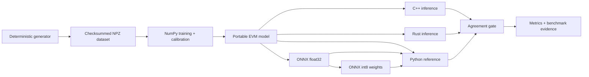

# Edge Vision Deployment Benchmark

[](https://github.com/JasonStys/edge-vision-deployment-benchmark/actions/workflows/ci.yml)
[](https://github.com/JasonStys/edge-vision-deployment-benchmark/actions/workflows/codeql.yml)
[](LICENSE)

A reproducible deployment laboratory for a compact image classifier. The repository generates its
own checksummed 8x8 image data, trains and calibrates a neural network, exports and quantizes ONNX,
and then verifies equivalent inference in Python, C++, and Rust. It reports accuracy, per-class
quality, calibration, robustness, latency percentiles, throughput, memory allocation, and a clearly
labeled energy proxy.

This is deliberately an engineering project rather than a notebook: every artifact has a rebuild
path, every parser has explicit limits, native runtimes have no third-party dependencies, and CI
checks the complete deployment contract.

## What it demonstrates

- Deterministic data generation, balanced stratified splits, SHA-256 provenance, and a dataset card.
- A from-scratch 64–24–12–3 ReLU network with full-batch training and held-out temperature scaling.
- A transparent text model format plus a standard ONNX graph and dynamic signed-int8 weight export.
- Cross-runtime test vectors proving Python, C++, and Rust stay within a `1e-5` probability tolerance.
- Clean, noisy, occluded, and dimmed evaluation with confusion matrices and calibration error.
- Warm CPU benchmarks with p50/p95/p99 latency, throughput, Python allocation peaks, and an energy proxy.
- Fail-closed file-size, row-count, dimension, finite-value, schema, and checksum validation.
- Pinned GitHub Actions, CodeQL, dependency review, Dependabot, sanitizers, Clippy, Ruff, mypy, and coverage.

## Architecture at a glance



The portable model makes native inference reviewable; ONNX demonstrates ecosystem deployment. The
same weights, preprocessing, class order, calibration temperature, and test vectors bind them
together. See [architecture](docs/ARCHITECTURE.md) and the
[decision record](docs/adr/0001-portable-model-and-onnx.md).

## Quick start

Python 3.12–3.14, CMake 3.20+, a C++20 compiler, Rust 1.90, and Node.js 24 are supported.

```bash
python -m venv .venv
source .venv/bin/activate
python -m pip install -r requirements.lock
python -m pip install --no-deps -e .
python -m edgevision validate --root .
python -m pytest
```

On Windows PowerShell, activate with `.venv\Scripts\Activate.ps1`. To rebuild all small committed
artifacts from source:

```bash
python -m edgevision build --root .
```

Build and compare the native runtimes:

```bash
cmake -S native/cpp -B .runtime/cpp -DCMAKE_BUILD_TYPE=Release
cmake --build .runtime/cpp --config Release
ctest --test-dir .runtime/cpp -C Release --output-on-failure
cargo test --manifest-path native/rust/Cargo.toml --locked

.runtime/cpp/edgevision_cpp
cargo run --release --locked --manifest-path native/rust/Cargo.toml -- artifacts/model/compact-mlp.evm artifacts/test-vectors.csv .runtime/rust.csv
python scripts/compare-native.py --reference artifacts/reference-predictions.csv --candidate .runtime/cpp.csv --candidate .runtime/rust.csv
```

Run the C++ executable from the repository root. It intentionally uses the allow-listed model,
vector, and output paths shown above instead of accepting filesystem paths from command-line input.

`scripts/verify.sh` runs the full local Linux/macOS sequence. Windows users can run the same commands
individually; CI exercises the reference Ubuntu toolchain.

## Major features

| Feature | Implementation | Evidence |
|---|---|---|
| Reproducible dataset | Geometric generator, typed NPZ, deterministic splits | `artifacts/dataset`, dataset card |
| Compact neural model | Two hidden ReLU layers and temperature calibration | portable model, generated model card |
| Portable deployment | Explicit ONNX graph and weight quantization | ONNX checker, Runtime tests |
| Native inference | Dependency-free C++20 and Rust 2024 parsers/runtimes | CTest, sanitizers, Cargo tests |
| Robustness analysis | Noise, occlusion, and brightness corruption suites | generated metrics report |
| Performance analysis | Warmups, percentile latency, throughput, memory, energy proxy | generated benchmark report |
| Supply-chain controls | Exact Python lock, Rust lock, pinned actions, audits | CI and security documentation |

## Repository map

| Path | Purpose |
|---|---|
| `src/edgevision/` | Data, training, serialization, ONNX, evaluation, and CLI code |
| `native/cpp/` | C++20 portable model parser, inference CLI, and unit tests |
| `native/rust/` | Dependency-free Rust parser, inference CLI, and tests |
| `tests/` | Python unit, integration, corruption, export, and artifact tests |
| `artifacts/` | Small generated dataset, models, vectors, predictions, and checksums |
| `scripts/` | Full verification, benchmarking, native comparison, and documentation gates |
| `docs/` | Requirements, design, operations, security, test strategy, reports, and code index |
| `.github/workflows/` | CI, CodeQL, and pull-request dependency review |

Every tracked file is summarized in [the file catalog](docs/FILE_CATALOG.md); declarations and exact
line locations are generated in [the code index](docs/CODE_INDEX.md).

## Release gates

A build is releasable only when clean float32 accuracy is at least 95%, quantization loses no more
than two percentage points, portable-to-ONNX maximum absolute error is at most `1e-5`, both native
runtimes match reference vectors within `1e-5`, and all static analysis, tests, artifact checks, and
security workflows pass. Performance numbers are characterization evidence rather than universal
guarantees because shared-runner hardware varies.

The checked release evidence records 100% accuracy on the 48-example synthetic test split, 97.36%
branch-aware Python coverage, and maximum C++/Rust reference error of `1.1920929e-7`. These results
validate the repository contract; they are not claims about real-camera performance.

## Documentation

- [Requirements](docs/REQUIREMENTS.md)
- [Architecture](docs/ARCHITECTURE.md)
- [Dataset card](docs/DATASET_CARD.md)
- [Benchmark method](docs/BENCHMARKING.md)
- [Testing strategy](docs/TESTING.md)
- [Operations runbook](docs/OPERATIONS.md)
- [Security model](docs/SECURITY.md)
- [Complexity analysis](docs/COMPLEXITY.md)
- [Limitations](docs/LIMITATIONS.md)
- [Research sources](docs/RESEARCH.md)
- [Deployment checklist](docs/DEPLOYMENT_CHECKLIST.md)
- [Validation report](docs/reports/VALIDATION.md)

## Scope and safety

The generated patterns are intentionally small and non-sensitive. This project is not a production
camera system, medical device, identity system, autonomous-control component, or benchmark across
different machines. Never treat the energy proxy as a physical power measurement. See
[limitations](docs/LIMITATIONS.md) before reusing the design.

## License

MIT. See [LICENSE](LICENSE).
