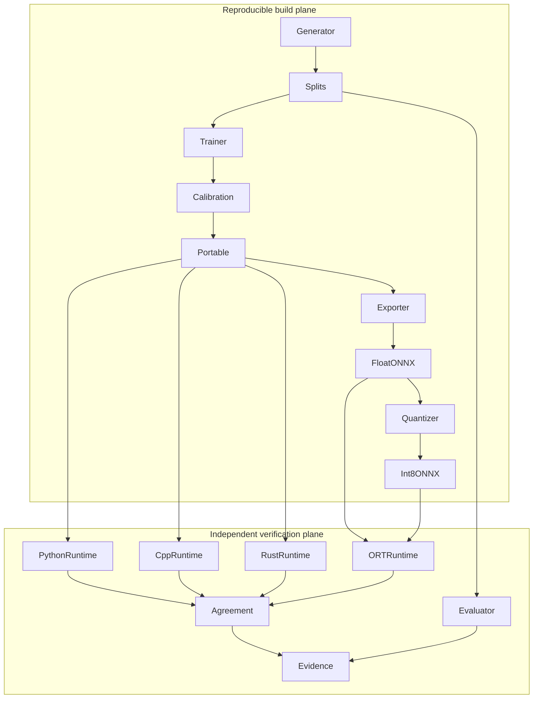

# Architecture

## High-level design

The system is a reproducible batch pipeline plus three inference surfaces. Data generation and model
training stay in Python because NumPy makes the numerical process concise and testable. Deployment is
represented twice: a standard ONNX graph for ecosystem tools and a deliberately narrow text artifact
for dependency-free native inference.

## Component boundaries

- `data.py` owns generation, stratification, corruption, persistence, and content identity.
- `model.py` owns learning, calibration, portable formatting, and NumPy inference.
- `export.py` is the only ONNX graph-construction and quantization boundary.
- `runtime.py` owns conservative ONNX Runtime session configuration and output validation.
- `metrics.py` owns statistical definitions and benchmark timing.
- `artifacts.py` owns exchange formats and integrity manifests.
- `pipeline.py` coordinates components but does not reimplement their logic.
- Native runtimes accept only version 1 of the fixed model contract; format evolution is explicit.

## Data flow and contracts

Images are float32 arrays of shape `[N, 64]`, row-major, finite, and normalized to `[0, 1]`. Labels
are integers `0..2` with class order `vertical`, `horizontal`, `diagonal`. The model is a
`64 -> 24 -> 12 -> 3` dense network with ReLU activations and scalar temperature before softmax.
Test vectors serialize the exact preprocessing output; native runtimes therefore do no hidden image
conversion. Probability CSVs preserve identifiers and class order for row-wise comparison.

## Reliability and failure behavior

Every file boundary rejects missing files, oversize inputs, unexpected shapes/counts, non-finite
numbers, range violations, schema drift, and trailing portable-model tokens. The manifest prevents
accidental or malicious artifact substitution inside the expected repository workflow. Failures are
fatal and explicit; no runtime silently truncates input, changes class order, or falls back to another
model.

## Scale characteristics

The included dataset has 240 examples and the model has fewer than 2,000 trainable scalar parameters.
Training is full-batch and intended for seconds on a CPU. Inference scales linearly with batch size and
parameter count. The hard batch limit of 100,000 and file limits keep memory predictable. For a larger
problem, replace full-batch training with minibatches, stream evaluation, store immutable artifacts in
object storage, and benchmark on dedicated target hardware; do not merely raise every limit.

## Observability

The pipeline emits sorted JSON for metrics, benchmark methodology, and validation checks. Generated
model and dataset cards explain provenance and limitations. CI retains coverage, native comparison,
and benchmark artifacts for review. There is no long-running service, so request tracing and uptime
metrics are not applicable.

## Trade-offs

The text model duplicates ONNX weights, but makes native implementations small, reviewable, and
dependency-free. Synthetic images improve reproducibility but reduce external validity. Dynamic
weight quantization is portable and cheap to evaluate but may not improve this tiny model on every
CPU. One-thread ONNX sessions reduce benchmark noise at the cost of peak throughput.

